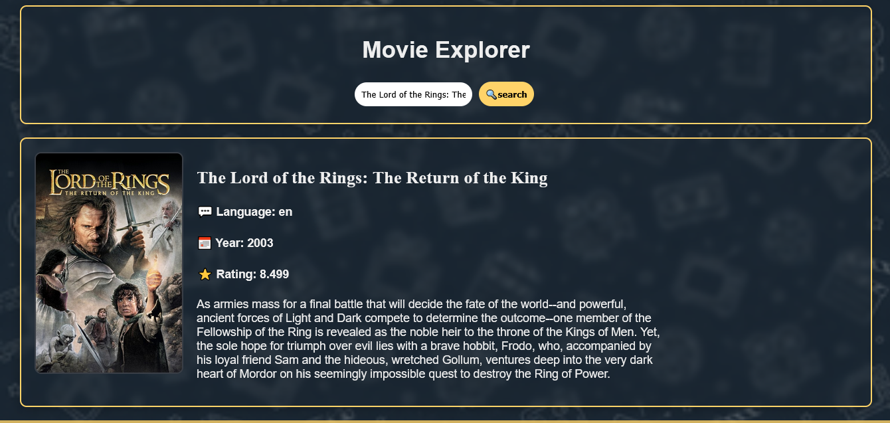
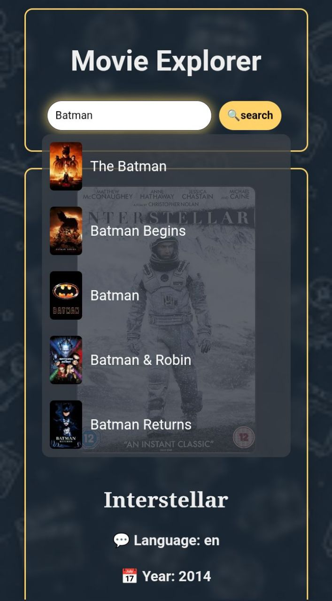

Movie Explorer 🎬

A simple movie search application built with HTML, CSS, and JavaScript using the TMDB API.

Features

- Search movies by title
- Live search suggestions
- Movie posters
- Movie ratings
- Original language display
- Release year display
- Responsive design for mobile and desktop
- Loading indicator
- Fallback poster for unavailable images

Technologies Used

- HTML5
- CSS3
- JavaScript (ES6+)
- TMDB API

## Screenshots

### Desktop View

  

### Mobile View

  

How to Use

1. Open the website.
2. Type a movie name in the search bar.
3. Select a suggestion or press Enter.
4. View movie details, rating, language, and poster.

Future Improvements

- Genre display
- Favorite movies system
- Advanced filtering
- Watchlist support

Author

Created by Canoheil as a JavaScript learning project.